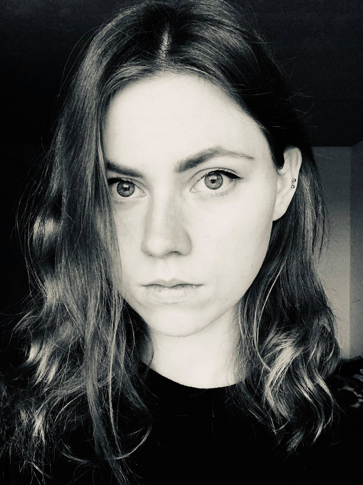

  My name is Marta Brzezińska, and I am currently a Senior Data Scientist at [Novigenix SA](https://novigenix.com/), working on whole blood transcriptomic profiling. I use my expertise in machine learning and data analysis to improve the biomarker discovery process.

Prior to entering the industry, I was a postdoctoral researcher in computational condensed matter physics at Ecole Polytechnique Fédérale de Lausanne (EPFL). I obtained my PhD in Physics under the supervision of [Prof. Arkadiusz Wójs](https://arkadiuszwojs.pwr.edu.pl/) and [Prof. Titus Neupert](https://www.physik.uzh.ch/en/groups/neupert/team/neupert.html). My research interests included topological states of matter. You can find my thesis on [here](https://github.com/martabrz/PhDThesis/blob/master/build/thesis_mbrzezinska.pdf). 

I am well-versed in numerical methods, including *supervised and unsupervised learning*, *exact diagonalization*, *tensor networks*, and *density functional theory*. Don't hesitate to reach out if you're interested in collaborating!

In free time: [HEMA](http://unilamhe.ch/en/) and gaming.

